import Tabs from '@theme/Tabs';
import TabItem from '@theme/TabItem';

# Defining Navigation Graphs


## Defining navigation graphs

As part of the core library, there's a `RootGraph` available you can use if you don't need to specify anything at the graph level.
For some applications, that will be enough: just using that in your Destination annotations (like `@Destination<RootGraph>`) and passing the generated `RootNavGraph` (or `NavGraphs.root`) to `DestinationsNavHost`.

However, if you need more control over the structure of the navigation graphs, Compose Destinations lets customize it in any way you want.

There are two types of NavGraphs:

- **NavHostGraph** - this nav graph does not have a parent graph as it is the root of the graph. These are the ones you can pass to `DestinationsNavHost` (hence the name "**NavHost**Graph").
`RootGraph` is one of such graphs.
- **Nested NavGraph** - this will be a subset of your graph that always has a parent graph, which itself could be nested as well or it could be NavHostGraph.

:::note
Most apps should look to have a single `DestinationsNavHost`, and so, a single `NavHostGraph` (which could be `RootGraph` or could be a custom one you create).
:::

### NavHostGraph annotation

By default, you can use `RootGraph`, but you can configure nav host graphs in some ways. If you need to do that, you can use `NavHostGraph` annotation:

```kotlin
@NavHostGraph(
    defaultTransitions = MyNavHostAnimatedDestinationStyle::class,
    route = "preferred_route",
    visibility = CodeGenVisibility.INTERNAL,
)
annotation class MainGraph
```

- `defaultTransitions` - default transitions for all destinations in this graph. Similar to `DestinationStyle.Animated` but lambdas can't return null since some default needs to be present, even if they return `EnterTransition.None` or `ExitTransition.None` (which is the default here `NoTransitions::class`).
- `route` - route of this graph. By default it would be "main" in this case. There aren't many reasons to want to control this, it's not a route you can navigate to.
- `visibility` - controls visibility of the generated object `MainNavGraph`. `PUBLIC` by default.

You can then use this annotation as you would `RootGraph`, as `@Destination<MainGraph>` or `@NavGraph<MainGraph>`, which would make the annotated element a direct child of main nav graph.

### NavGraph annotation

To define a nested navigation graph, you need to create an annotation class annotated with `@NavGraph` using the parent graph as type argument. For example:

```kotlin
@NavGraph<RootGraph>(
    route = "preferred_route",
    start = true,
    navArgs = SettingsNavGraphArgs::class,
    deepLinks = [DeepLink(/*...*/)],
    defaultTransitions = MyDestinationStyleAnimated::class,
    visibility = CodeGenVisibility.INTERNAL,    
)
annotation class SettingsGraph
```

- `route` - unique id name of the nav graph used to register it in the `DestinationsNavHost`.
By default the name of the annotation class will be used removing "Graph" or "NavGraph" (case insensitive)
and changing it to snake case.
- `start` - whether this navigation graph will be the start of its parent navigation graph,
false by default.
- `navArgs` - class with a primary constructor where all navigation arguments specific
to this navigation graph are to be defined.
- `deepLinks` - array of `DeepLink` which can be used to navigate to this navigation graph
- `defaultTransitions` - defines the navigation animations that destinations of this navigation graph
use when entering/leaving the screen. These animations will only be used on destinations
that do not set any specific style with `Destination.style` parameter.
- `visibility` - `CodeGenVisibility` of the corresponding generated NavGraph object.
Useful to control what the current module exposes to other modules. By default, it is public.

After the annotation, you can use it like:

```kotlin
@Destination<SettingsGraph>(start = true)
@Composable
fun SettingsMainScreen() { /*...*/ }

// OR to make a graph nested in Settings one

@NavGraph<SettingsGraph>
annotation class ProfileSettings
```

## Visualisation and documentation

### Through mermaid graphs

Each module using Compose Destinations will generate mermaid graphs at compile time. Because they're auto generated at compile time, they'll always be up to date, and so, they are a good source of truth for the state of your app's navigation graphs.

Two files get generated for each top level graph of the module:

- `GraphName.mmd` - mermaid file with just the mermaid format for that graph
- `GraphName.html` - mermaid graph in HTML form so you can open it in a browser, zoom, pan around.

By default, each module will create these graphs next to the generated code. The directory where they're generated is controlled by KSP, and it may not be so useful like that.

You can however, define paths where you want these to be generated at, like this:

```kotlin
ksp {
    // .mmd file
    arg("compose-destinations.mermaidGraph", "$rootDir/docs")
    // .html file
    arg("compose-destinations.htmlMermaidGraph", "$rootDir/docs")
}
```

Then, you can commit them (probably just the mermaid one, since it even gets rendered on Github) to version control and make all changes to the navigation graph visible at code review.

> If you want to commit only the .mmd or only the .html but you stil find useful to see both locally, you can add this to `.gitignore`:  
> `/docs/*NavGraph.html` (for the above example paths)
>
> Or you can generate them in different folders and ignore one of them.


Since mermaid is just "rendered text", you can both check the text diff when changes happen in a PR and also see the graphs visually (since Github renders them. You can also paste the mermaid formatted text to [mermaid.live](https://mermaid.live), if not using Github to see how it looks like.)

#### Here is an example of how these graphs look like: (ignore the screens and graph names 😅)

```mermaid
---
title: Root Navigation Graph
---
graph TD
root(["RootGraph"]) -- "start" --- greeting_screen("GreetingScreen")
root(["RootGraph"]) --- root/stats_screen("StatsScreen")
root(["RootGraph"]) --- root/profile_settings_screen("ProfileSettingsScreen")
root(["RootGraph"]) --- feed("Feed")
root(["RootGraph"]) --- go_to_profile_confirmation("GoToProfileConfirmation")
root(["RootGraph"]) --- test_screen("TestScreen")
root(["RootGraph"]) --- test_screen2("TestScreen2")
root(["RootGraph"]) --- test_screen3("TestScreen3")
root(["RootGraph"]) --- settings(["SettingsGraph 🧩"])
root(["RootGraph"]) --- profile(["ProfileGraph"])
profile(["ProfileGraph"]) --- profile_screen("ProfileScreen")
profile(["ProfileGraph"]) --- profile_settings("ProfileSettings")

classDef destination fill:#5383EC,stroke:#ffffff;
class root/stats_screen,root/profile_settings_screen,feed,go_to_profile_confirmation,test_screen,test_screen2,test_screen3,greeting_screen,profile_screen,profile_settings destination;
classDef navgraph fill:#63BC76,stroke:#ffffff;
class settings,profile,root,settings,profile navgraph;
```

<Tabs>
  <TabItem value="render" label="render" default>



</TabItem>
<TabItem value="code" label="code">

```
---
title: Root Navigation Graph
---
graph TD
root(["RootGraph"]) -- "start" --- greeting_screen("GreetingScreen")
root(["RootGraph"]) --- root/stats_screen("StatsScreen")
root(["RootGraph"]) --- root/profile_settings_screen("ProfileSettingsScreen")
root(["RootGraph"]) --- feed("Feed")
root(["RootGraph"]) --- go_to_profile_confirmation("GoToProfileConfirmation")
root(["RootGraph"]) --- test_screen("TestScreen")
root(["RootGraph"]) --- test_screen2("TestScreen2")
root(["RootGraph"]) --- test_screen3("TestScreen3")
root(["RootGraph"]) --- settings(["SettingsGraph 🧩"])
root(["RootGraph"]) --- profile(["ProfileGraph"])
profile(["ProfileGraph"]) --- profile_screen("ProfileScreen")
profile(["ProfileGraph"]) --- profile_settings("ProfileSettings")

classDef destination fill:#5383EC,stroke:#ffffff;
class root/stats_screen,root/profile_settings_screen,feed,go_to_profile_confirmation,test_screen,test_screen2,test_screen3,greeting_screen,profile_screen,profile_settings destination;
classDef navgraph fill:#63BC76,stroke:#ffffff;
class settings,profile,root,settings,profile navgraph;
```

</TabItem>
</Tabs>

<div style={{textAlign: 'center', paddingBottom: 30}}>
    <i>Mermaid graph file</i>
</div>


#### And here is an example of an interactive html file generated by the library (click on RootNavGraph)

[RootNavGraph](pathname:///navgraphs/RootNavGraph.html)

:::info hint
Graphs that contain "🧩" emoji are imported from other modules, so that mermaid graph will be in another file.

Clicking on them navigates you to that other graph - **IF** it was generated on the same custom path, otherwise the library won't be able to since it doesn't
know where the other graph files are located.

You can reset zoom and placement with "R" key and zoom in / zoom out with "+" / "-" or with mouse scroll. You can also pan it around.
:::

### Through code documentation

Compose Destinations generates documented code to give you both a quick overview of why it was generated
and in the case of NavGraphs, the structure of that graph.
This also allows you to navigate through the your code / generated code, since the references in the generated code
are linked to your graphs / destinations.

Here are some example images taken from Android Studio:

<div style={{textAlign: 'center'}}>
  
</div>

<div style={{textAlign: 'center', paddingBottom: 30}}>
    <i>kdocs look on NavGraphs objects</i>
</div>

Hopefully this can give you an overview of how the graphs you have look like as well as helping you navigate (you can ctrl click on those links) to each of those screens.
